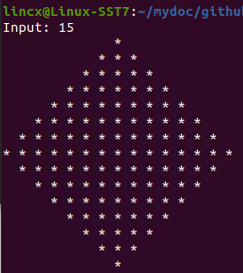
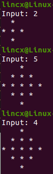
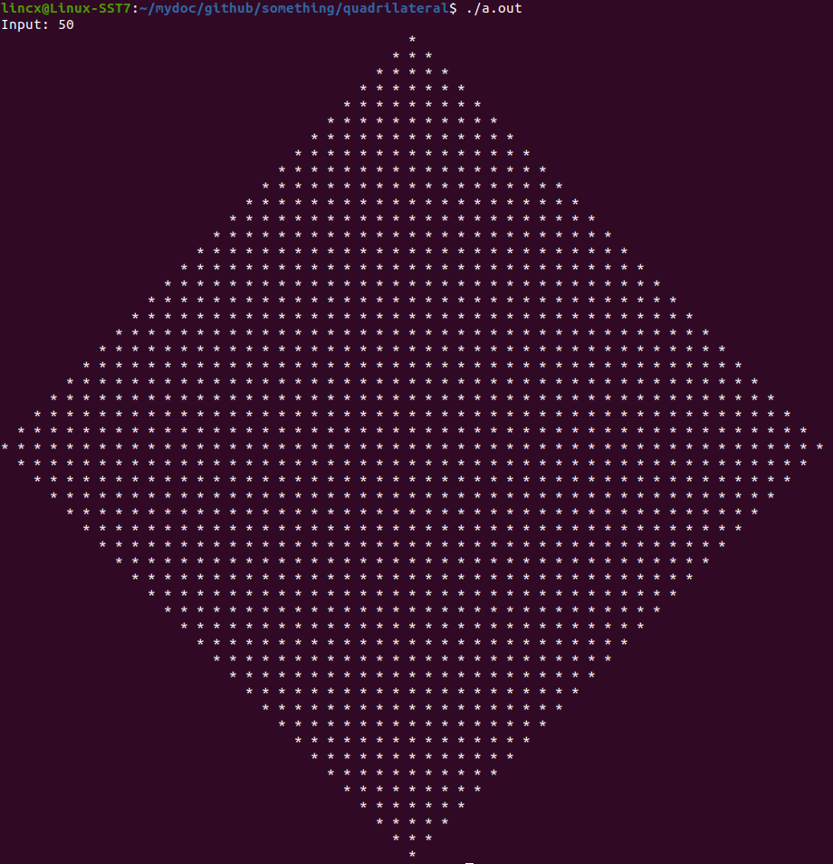

#  Introduction

##  Question

根据输入打印不同大小的四边形

* Input: size, integer number
* Output: variable size quadrilateral

* Examples:

  






## 思路

* 使用绝对值实现星号前的空格打印个数控制，再通过减法算出星号需要的个数。

```c++
// n为输入，表示size; a为n的一半, int类型; b为n对于2的取余, int类型
int a = n / 2, b = n % 2;
// i为当前行数
for (i = 0; i < n; ++i) {
    // temp表示a-i的绝对值, a不变而i逐渐增加, 以此达到temp值从多到少再到多的效果。
    int temp = abs(a - i);
    for (j = 0; j < temp; ++j)
        cout << "  ";
    // 知道了当前行空格的数目, 接下来总空间减去空格的位置用来打印星号就好了
    for (x = 0; x < (a + b - temp + a + b - temp - 1); ++x)
        cout << "* ";
    // 每行结束以后换行
    cout << endl;
}
```

* 上述代码进行简化后即为

```c++
#include <iostream>
using namespace std;

int main(int args, char** argv) {

  // receive n and preprocessing
  int n = 0;
  cout << "Input: ";
  cin >> n;
  if (n < 0) {
    cout << "Wrong input!" << endl;
    return -1;
  }
  if (n % 2 == 0)
    ++n;
  // print quadrilateral
  for (int i = 0; i < n; ++i) {
    for (int j = 0; j < abs(n/2 - i); ++j)
      cout << "  ";
    for (int k = 0; k < (2 * (n/2 - abs(n/2 - i)) + 1); ++k)
      cout << "* ";
    cout << endl;
  }

  return 0;
}
```

